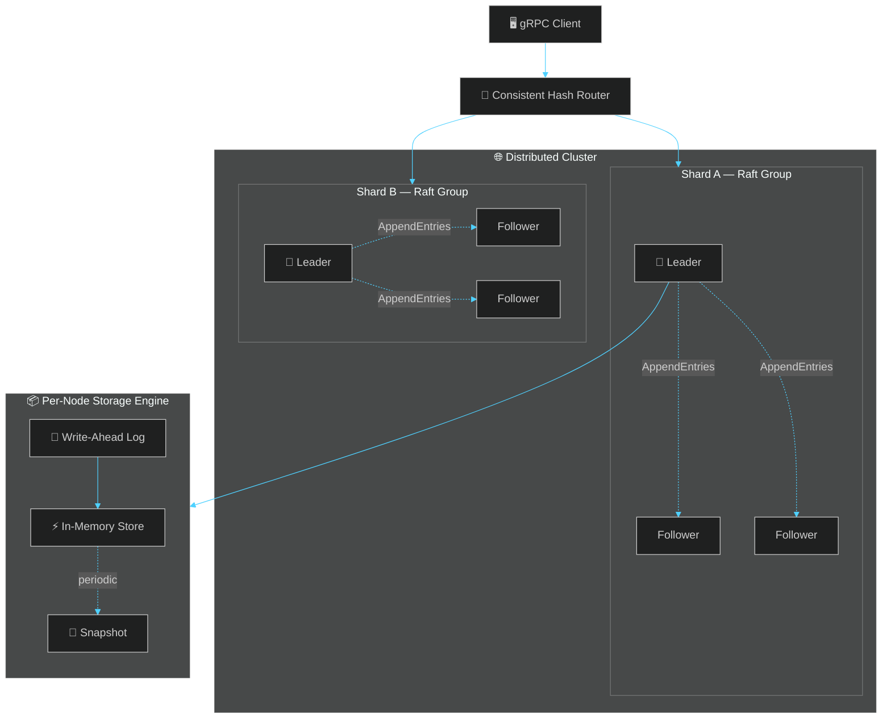

<div align="center">


<br>

<a href="#">
  
</a>

<br><br>


<br><br>


</div>

<br>


<br>

## 🧭 Overview

> A distributed key-value store implemented **from first principles** — no off-the-shelf consensus library, no managed database underneath. Every layer, from the write-ahead log to leader election to shard routing, is hand-built to understand *why* systems like etcd, CockroachDB, and TiKV work the way they do.

<div align="center">
<table>
<tr>
<td align="center" width="25%">
<h3>📝</h3>
<b>WAL + Snapshots</b><br/>
<sub>Crash-consistent storage</sub>
</td>
<td align="center" width="25%">
<h3>👑</h3>
<b>Raft Consensus</b><br/>
<sub>Leader election + replication</sub>
</td>
<td align="center" width="25%">
<h3>🔀</h3>
<b>Consistent Hashing</b><br/>
<sub>Sharded, horizontally scalable</sub>
</td>
<td align="center" width="25%">
<h3>💥</h3>
<b>Fault Injection</b><br/>
<sub>Survives kill -9 and partitions</sub>
</td>
</tr>
</table>
</div>

<br>

## 🏗️ Architecture



<br>

## 📊 Build Progress

<div align="center">

| Layer | Component | Status |
|:---|:---|:---:|
| **Storage** | In-memory store (`asyncio`-safe) | ✅ |
| **Storage** | Write-ahead log | ✅ |
| **Storage** | Snapshotting + WAL rotation | 🚧 |
| **Networking** | Async gRPC server | ⬜ |
| **Consensus** | Raft leader election | ⬜ |
| **Consensus** | Raft log replication | ⬜ |
| **Sharding** | Consistent hashing + virtual nodes | ⬜ |
| **Resilience** | Fault injection / partition tests | ⬜ |

</div>

<br>

<details>
<summary><b>🚀 Getting Started</b> — click to expand</summary>
<br>

```bash
# clone
git clone https://github.com/<your-username>/distributed-kv-store.git
cd distributed-kv-store

# environment
python -m venv venv
source venv/bin/activate
pip install -r requirements.txt

# run tests
pytest tests/ -v

# start a single node
python -m kvstore.server --port 8001
```

</details>

<details>
<summary><b>🧪 Simulating a Cluster Locally</b> — click to expand</summary>
<br>

```bash
python -m kvstore.server --port 8001 --peers 8002,8003 &
python -m kvstore.server --port 8002 --peers 8001,8003 &
python -m kvstore.server --port 8003 --peers 8001,8002 &

# kill the leader mid-write — watch a new one get elected
kill -9 $(lsof -t -i:8001)
```

</details>

<details>
<summary><b>📁 Project Structure</b> — click to expand</summary>
<br>

```
distributed-kv-store/
├── src/kvstore/
│   ├── store.py       → in-memory core
│   ├── wal.py          → write-ahead log
│   ├── snapshot.py     → snapshotting
│   ├── raft.py         → consensus (election + replication)
│   ├── shard.py        → consistent hashing / routing
│   └── server.py       → async gRPC server
├── proto/kvstore.proto
├── tests/
└── README.md
```

</details>

<br>

## 🎯 Why This Exists

Most "distributed KV store" tutorials wrap Redis or call a consensus library. This one doesn't — every layer is implemented and tested against real failure scenarios: killed processes, partitioned networks, and split-brain conditions. Built as the coordination/caching layer for a paired on-device LLM inference engine, where it handles distributed prefix-cache storage across inference nodes.

<br>


<div align="center">
<br>

<sub>Built as part of an AI/ML + systems engineering portfolio · MIT License</sub>

<br><br>


</div>
